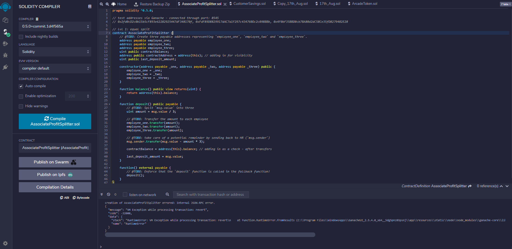
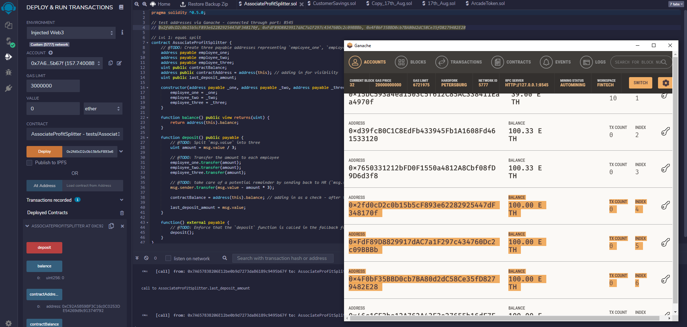
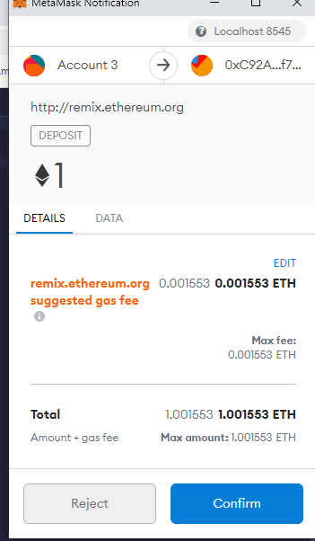
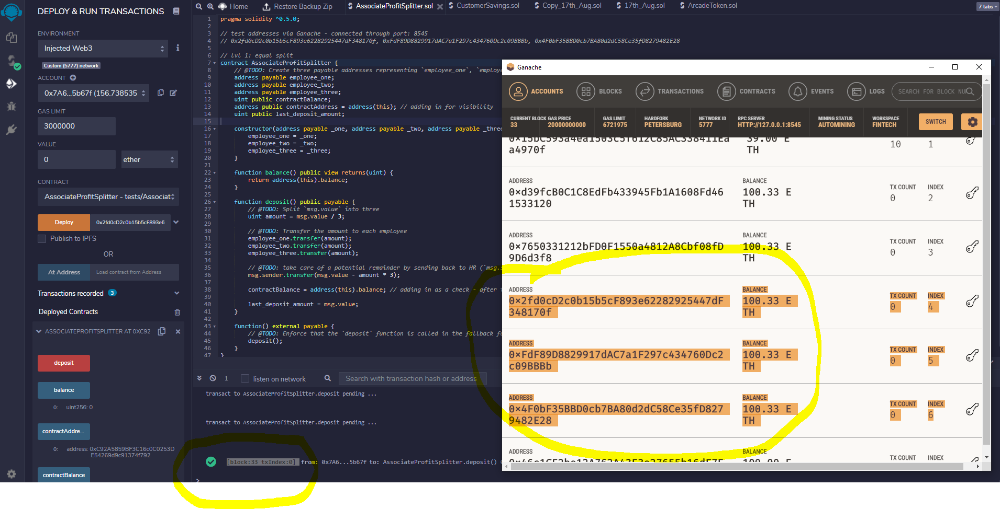

# Unit_20_First_Contract

# Unit 20 - "Looks like we've made our First Contract!"

## Background
Your new startup has created its own Ethereum-compatible blockchain to help connect financial institutions, and the team wants to build smart contracts to automate some company finances to make everyone's lives easier, increase transparency, and to make accounting and auditing practically automatic.

## Level One: The AssociateProfitSplitter Contract

How the contract works: This will accept Ether into the contract and divide the Ether evenly among the associate level employees. 

Motivation: This will allow the Human Resources department to pay employees quickly and efficiently.

Testnet addresses used: N/A for Level One.

## Screenshots

Compiler example

Pre-transfer of associate's profits example

Metamask example

Confirmation example

